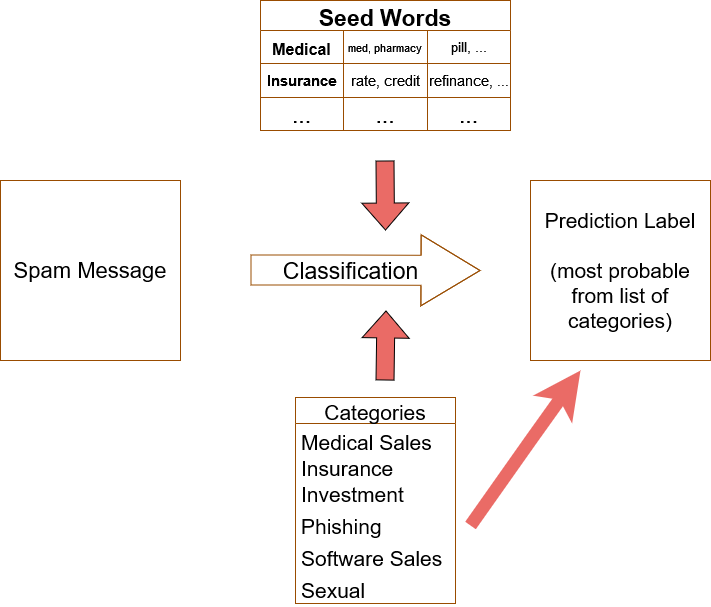
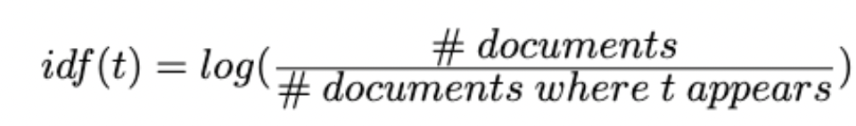
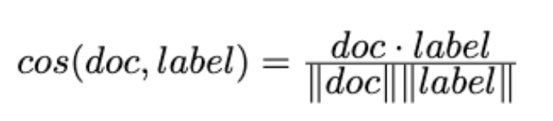
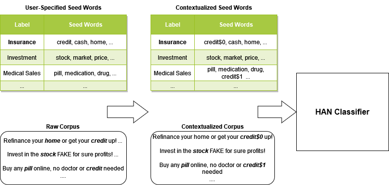
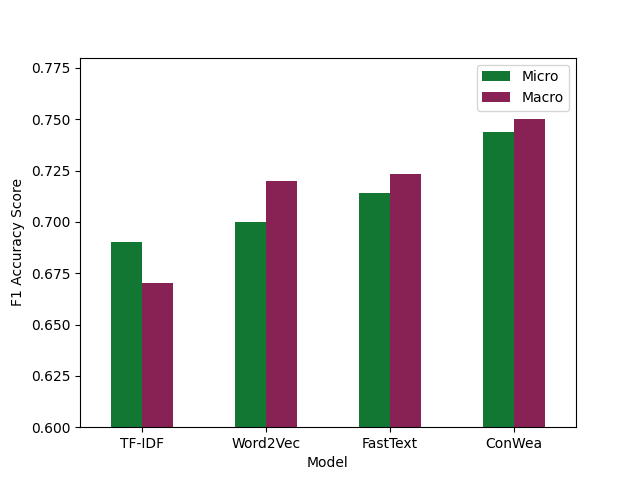

## Weakly Supervised Spam Label Classification

This website represents our static version for our findings on classifying spam into different labels.

## **Abstract**
Given the abundance of spam that occurs in today's day and age, our goal is to classify spam messages into some of the most common categories and find trends within these categories that could improve spam detection systems currently in place. Using a variety of methods in Natural Language Processing spanning from simple to complex methods, we will explore the benefits and downsides of using such models. More interesting, the Federal Trade Commission has releasted a report showing that consumers lost nearly 8.8 BILLION dollars to scam attacks last year. The most popular being investment and phishing scams. We aim to try to reduce costs of both the companies making these filters and the cost of consumers falling into these attacks. 

## **Data Overview**
The data used was collected from the most reputable E-Mail dataset known as Enron (include link). This data contains 36000 emails split up into 6 groups, where in each group 4500 emails are declared as spam and 1500 are declared as "ham" (not spam). Since there is no labels on the E-Mails that were declared as spam, human annotation was required to create such labels and manually label all this data. We wanted to keep our model in a setting where generalization is a big factor given that spam messages change drastically over time, so we took only one set of these messages (6000) and annotated the 4500 spam messages into popular categories of spam including; medical, software, insurance, phising, sexual, etc.

## **Problem Overview**

    

## **Models**

### IR-TF-IDF
We started with baseline models to get an idea of how well they will perform in relation to some of the more complex models. First, we leveraged a classical method known as IR-TF-IDF - which put simply refers to counting up the number of seed words in each class and picking the class that has the highest occurrence in the message.
- Data cleaning and preprocessing: Change all sentences to be lower-cased. Remove punctuation, trailing white spaces and stop words using NLTK.
- TF-IDF calculation: For each seedword, calculate its TF-IDF value with respect to a specific document using the following formula;
    tfidf(t, d) = tf(t,d) * idf(t)
 Where 
    tf(t, d) = # of times t appears in d
 and 
 
    

    
    

    
 For each document, sum up all TF-IDF values for all seedwords within a label, and assign the document with the label that has the highest TF-IDF sum.
 - Micro/Macro F1 calculation: Use sklearn.metrics.f1_score to derive Micro and Macro F1 scores, respectively.

### Word2Vec
As our next baseline model, we implemented another classical technique Word2Vec. 
- Data cleaning and preprocessing: Change all sentences to be lower-cased. Remove punctuation, trailing white spaces and stop words using NLTK. 
- Word2Vec Model Training: Initialize a Word2Vec vector from gensim and specify size = 110, window = 5, min_count = 1. Use 4 workers and train for 800 epochs. 
- Cosine similarity calculation: For each seedword, fetch the corresponding vector from Word2Vec model. Take the average of all vectors within a label and use that as the final word vector. For a single document, simply take the average of all word vectors within that document. Compute the cosine similarity between a document and a label using the following formula 

    

    
    

    
Where doc represents the word vector for a document, and label represents the word vector for a label. Assign the document with the label that has the highest cosine similarity.
- Micro/Macro F1 calculation: Use sklearn.metrics.f1_score to derive Micro and Macro F1 scores, respectively.

### FastText
We used the word vector representations trained by unsupervised FastText for prediction.
- Data cleaning and preprocessing: Change all sentences to be lower-cased. Remove punctuation, trailing white spaces and stop words using NLTK. 
- FastText Model Training: Initialize a FastText model and specify lr=0.05, wordNgrams=5, loss='hs', dim=50. Train for 600 epochs. 
- Cosine similarity calculation: The calculation and prediction procedure is similar to that of Word2Vec, the only difference is that we use different word embeddings.
- Micro/Macro F1 calculation: Use sklearn.metrics.f1_score to derive Micro and Macro F1 scores, respectively.

### ConWea
Contextualizesd Weakly Supervised Text Classification. \
ConWea aims to produce context for words, since human language is so dependant on context this would help our models performance. Contextualizing both the seed words and the documents, we are left with a contextualized corpus that can have the same words with different meanings based on their context. This will end up disambiguating the user provided seed words, which is very important if we are given fine-grained seed word labels. ConWea uses a Hierarchial Attention Network to do the predictions. More information on the whole process behind ConWea, which was created by our mentor Jingbo Shang along with Dheeraj Mekala, can be found [here](https://aclanthology.org/2020.acl-main.30.pdf)

## **Conclusion and Results**

    

FastText outperforms TFIDF and Word2Vec with an accuracy scores higher than 0.7. We are able to extract meaningful relationship between the spam email contents and the spam label using weakly supervised learning with a set of seed words for each label class. 
A limitation to our model is the spam emails in Enron dataset are similar to each other, thus we expect the model to perform a little bit worse when the user input spam email in its unseen format. We aim to build an interactive website for people to play with the model, and at the same time, we will retrain and update the model with more data in the future. 

## References
[1]  Dheeraj Mekala and Jingbo Shang. 2020. Contextualized Weak Supervision for Text Classification. In Proceedings of the 58th Annual Meeting of the Association for Computational Linguistics. Association for Computational Linguistics. https://aclanthology.org/2020.acl-main.30

[2] A. Joulin, E. Grave, P. Bojanowski, T. Mikolov, Bag of Tricks for Efficient Text Classification. https://arxiv.org/abs/1607.01759

